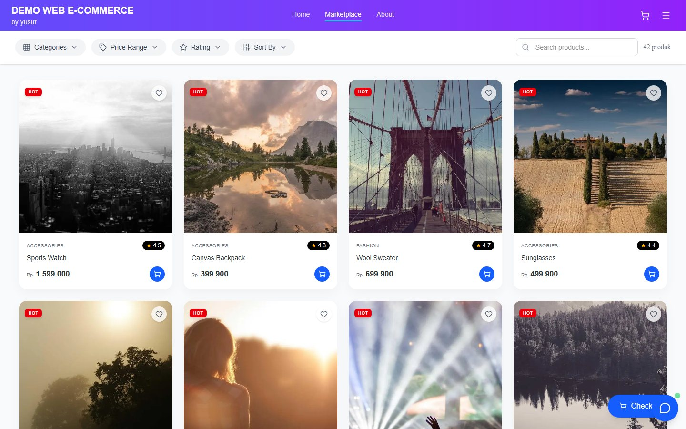

# E-Commerce System



## Ringkasan

E-Commerce System adalah platform marketplace modern dengan katalog produk responsif, cart flow, role-based dashboard, seller tools, dan admin management. Project ini dibuat sebagai studi kasus frontend commerce dan product management dashboard.

Fokus utama project ini adalah menyediakan katalog responsif siap checkout sekaligus fondasi dashboard untuk admin dan seller.

## Problem

Website e-commerce tidak cukup hanya menampilkan daftar produk. User perlu menemukan produk dengan cepat, seller perlu mengelola produk/order, dan admin perlu memantau ekosistem marketplace dengan alur yang jelas.

E-Commerce System menggabungkan marketplace UI, product discovery, cart interaction, dan dashboard management agar pengalaman belanja dan pengelolaan produk terasa lebih siap pakai.

## Role & Scope

- Merancang UI marketplace, product grid, filter, cart, dan checkout path.
- Membangun dashboard untuk admin dan seller.
- Menyusun role-based authentication dan flow manajemen produk.
- Menghubungkan database, seed data, API route, dan responsive frontend.

## Features

- Marketplace responsive dengan search, category, price range, rating, dan sort.
- Product cards dengan wishlist, rating, price, dan cart interaction.
- Cart drawer / checkout entry point untuk simulasi flow pembelian.
- Admin dashboard untuk monitoring dan manajemen marketplace.
- Seller dashboard untuk products, orders, inventory, dan analytics.
- Product approval, role-based access, dan database sync foundation.

## Tech Stack

- **Framework:** Next.js 16, React 19, TypeScript
- **Styling:** Tailwind CSS v4, responsive UI components
- **Database & ORM:** PostgreSQL/Neon, Prisma
- **Authentication:** NextAuth, role-based flow
- **Forms & Validation:** React Hook Form, Zod
- **Charts & Motion:** Recharts, Chart.js, Framer Motion
- **Icons:** Lucide Icons

## Live Demo

- **Demo:** https://ecommersesystest.vercel.app/
- **Marketplace:** https://ecommersesystest.vercel.app/marketplace
- **Portfolio case study:** https://cinematic-portfolio-v3-seven.vercel.app/

## Demo Credentials

Marketplace bisa dilihat tanpa login. Untuk mencoba area dashboard/admin, gunakan akun demo berikut.

| Role | Email | Password |
| --- | --- | --- |
| Admin / Tester | `akuntester@gmail.com` | `12345678` |

## Cara Menjalankan Local

```bash
git clone https://github.com/my-system/e-commerse.git
cd e-commerse
npm install
cp .env.example .env
npm run db:generate
npm run db:push
npm run db:seed
npm run dev
```

Setelah server berjalan, buka:

```text
http://localhost:3000
```

## Environment

Isi `.env` mengikuti `.env.example`. Minimal siapkan koneksi database PostgreSQL/Neon, konfigurasi authentication, dan environment lain yang dipakai untuk dashboard/demo.

## Project Status

Portfolio/demo project. Fokus utama project ini adalah menunjukkan kemampuan membangun commerce frontend, dashboard management, role-based flow, dan responsive product interface.
